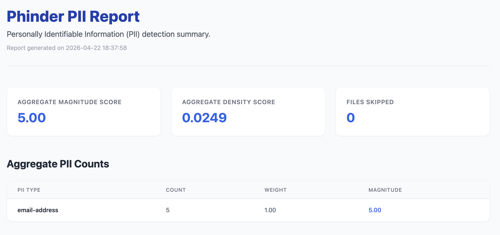

# Phinder

A Java application that uses the [Phileas](https://github.com/philterd/phileas) library to identify PII (Personally Identifiable Information) in text across a wide variety of file formats.



## Documentation

Comprehensive documentation can be found in the `docs/` directory or can be hosted using MkDocs.

- [Getting Started](docs/docs/getting-started.md)
- [Supported File Types](docs/docs/supported-file-types.md)
- [Usage Guide](docs/docs/usage.md)
- [Magnitude & Density Scores](docs/docs/configuration/weights.md)
- [Reporting](docs/docs/reports.md)
- [CLI Options](docs/docs/cli-options.md)

## Quick Start

### Build the project

```bash
mvn clean install
```

### Run the application

```bash
java -jar target/phinder-1.0.0-SNAPSHOT.jar -i src/test/resources/input.txt
```

To process a directory recursively:

```bash
java -jar target/phinder-1.0.0-SNAPSHOT.jar -i src/test/resources/ -R
```

For more examples and detailed usage, please refer to the [Usage Guide](docs/docs/usage.md).

## License

Copyright 2026 Philterd, LLC.

This project is licensed under the Apache License 2.0.
